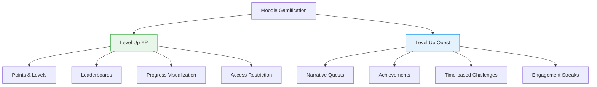
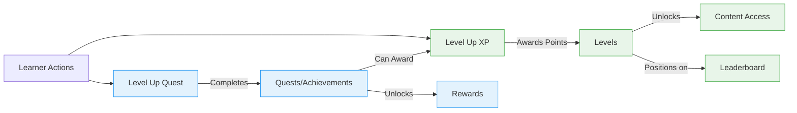

# Level Up XP vs Level Up Quest

Both Level Up XP and Level Up Quest are powerful gamification plugins for Moodle, but they serve different purposes and complement each other in creating engaging learning experiences. This guide explains what each plugin does, how they differ, and when to use each one.

## Overview

  

    <h3 style={{ color: '#2e7d32' }}>Level Up XP</h3>
    
<strong>Core Focus:</strong> Points-based progression system

    
<strong>Primary Mechanics:</strong> Experience points, levels, leaderboards

    
<strong>Engagement Style:</strong> Continuous, quantitative progress tracking

  

  

    <h3 style={{ color: '#0d47a1' }}>Level Up Quest</h3>
    
<strong>Core Focus:</strong> Guided learning journeys

    
<strong>Primary Mechanics:</strong> Quests, achievements, challenges, streaks

    
<strong>Engagement Style:</strong> Narrative-driven, milestone-based

  

## Key Differences Visualized

## When to Use Each Plugin

### Level Up XP is Best For:

- **Quantitative Progress Tracking**: When you want to reward consistent activity and participation
- **Competitive Environments**: When leaderboards and visible progress comparisons motivate your learners
- **Gradual Skill Development**: When you want to show incremental progress through levels
- **Content Gating**: When you want to unlock content based on a learner's overall progress level

### Level Up Quest is Best For:

- **Guided Learning Paths**: When you want to direct learners through specific learning journeys
- **Milestone Celebration**: When you want to acknowledge completion of significant learning objectives
- **Narrative Engagement**: When you want to embed learning in stories and characters
- **Habit Formation**: When you want to encourage regular, consistent participation through streaks

## How They Work Together

Level Up XP and Level Up Quest are designed to complement each other:

For example:
- Completing a Quest in Level Up Quest can award XP points in Level Up XP
- Reaching a certain level in Level Up XP can be an objective in a Level Up Quest achievement
- Both systems can work together to create a comprehensive gamification strategy

## Feature Comparison

| Feature | Level Up XP | Level Up Quest |
|---------|------------|---------------|
| **Core Mechanics** | Points, Levels | Quests, Achievements, Challenges, Streaks |
| **Progress Tracking** | Experience bar, Level indicators | Objective completion, Collection of achievements |
| **Competition** | Leaderboards (individual & team) | Challenge completion rates |
| **Narrative Elements** | Minimal | Strong (character-driven quests) |
| **Time Sensitivity** | Continuous progression | Can include time-limited challenges |
| **Reward Types** | Points, Level badges | Various rewards including XP points |
| **Content Access** | Level-based restrictions | Objective-based unlocking |

## Implementation Strategy

For the most effective gamification strategy:

1. **Start with Level Up XP** to establish the basic points and levels framework
2. **Add Level Up Quest** to create specific guided learning experiences
3. **Integrate the systems** by using Quest rewards to award XP points
4. **Layer in complexity** as learners become familiar with the gamification elements

## Conclusion

While Level Up XP focuses on continuous progression through points and levels, Level Up Quest adds narrative depth and guided experiences through quests and achievements. Together, they create a comprehensive gamification ecosystem that can significantly enhance learner engagement and motivation in your Moodle environment.

Both plugins support your learning objectives in different but complementary ways - Level Up XP provides the quantitative backbone of progression, while Level Up Quest adds qualitative, story-driven experiences that guide and celebrate learning milestones.
