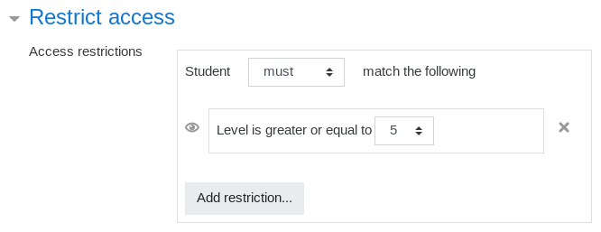

# Unlock an activity at a certain level

:::info

This feature requires the availability plugin [Level Up Availability](https://moodle.org/plugins/availability_xp) to be installed and enabled. The Moodle setting `enableavailability` must also be enabled.

:::

1. Navigate to the settings of the activity or resource to restrict the access to
2. Locate the section _Restrict access_
3. Click the button _Add a restriction_ and select _Level_
4. Choose the desired level from the dropdown and save the changes

**Protip:** This can also be applied to whole sections.

More on access restriction at [Moodle documentation](https://docs.moodle.org/en/Restrict_access_settings).
