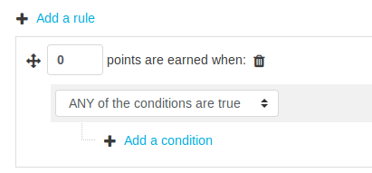
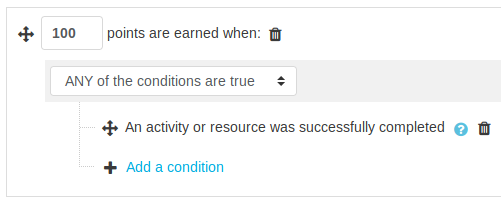
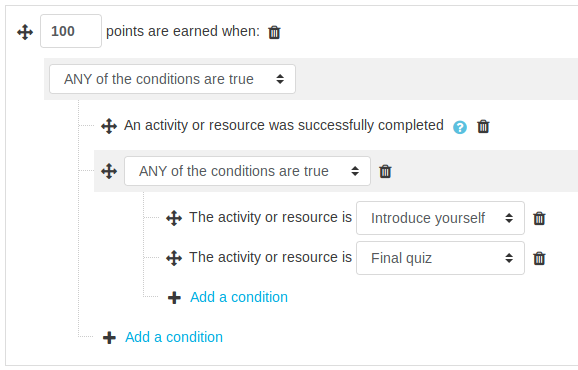
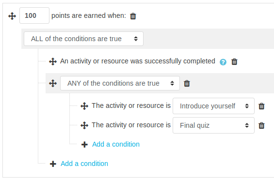

# Reward activity completion

import RequiresXpPlus from '@site/src/components/RequiresXpPlus';

<RequiresXpPlus />

Activity completion with Level Up XP allows you to reward learners for completing their activities and resources. In order for it to work, _Completion_ must be enabled in Moodle.

We need to create a new rule to set how many points a student should receive. Head to the block’s **rules page**.

import XpRulesPageLocation from '@site/src/components/XpRulesPageLocation';

<XpRulesPageLocation />

We need to to tell the plugin that whenever a student complete’s an activity, they should receive a fairly decent amount of points, say `100`. Click on the first **+ Add a rule** option. This will add an empty condition set on top of all the other ones, like this:



After changing the points to be earned to `100`, click on **+ Add a condition** and select **Activity completion**. You will get this:



At this stage, whenever our students complete an activity, they will be receiving `100` points. In each activity you have control over more settings which dictates when an activity is deemed complete, for instance an activity can be marked as complete only when the student receives a passing grade. Refer to [Moodle documention](https://docs.moodle.org/en/Activity_completion) for more on this.

### Reward specific activities only

There are cases where you will want to only target a few activities, perhaps because they have more value in your course. So starting from our previous example, we will adapt the rule to reward our student when they complete the activity _Introduce yourself_ or the activity _Final quiz_.

Let’s start by adding a new sub group of conditions by clicking on **+ Add a condition** and selecting **Set of conditions**. It is very important that the condition is set to **ANY of the conditions are true**, like so:


In this new set of conditions, we will add two **Activity or resource conditions**, and in each of these we will select the activities mentioned above, namely _Introduce yourself_ and _Final quiz_. (Use the _+ Add a condition_ located within our new set of conditions).



**Wait!** We are not finished yet. There is a **major problem** in our rule, can you spot it? Our first group of condition is not set-up properly, let’s read the whole rule together.

```
Give 100 points to my students when:
  |
  |-- An activity or resource is completed
  |
  OR
  |
  |-- When:
       |
       |-- The activity is 'Introduce yourself'
       |
       OR
       |
       |-- The activity is 'Final quiz'
```

Our rule _An activity or resource is completed_ is not always required, because of the **OR** statement. So if we leave the rule as is, our students will be rewarded for completing any activity, or for participating in our activities _Introduce yourself_ and _Final quiz_, this is not at all what we intended.

The bad _OR_ statement comes from the top group of conditions being set to _ANY of the conditions are true_. Instead, what we need is an **AND**, which we get by using **ALL of the conditions are true**. Like so:



Which we can now read as:

```
Give 100 points to my students when:
  |
  |-- An activity or resource is completed
  |
  AND
  |
  |-- When:
       |
       |-- The activity is 'Introduce yourself'
       |
       OR
       |
       |-- The activity is 'Final quiz'
```

### Good to know

- Students are only ever rewarded once for completing their activities.
- Completing an activity with the failed status is ignored, generally when a passing grade is required and not met.
