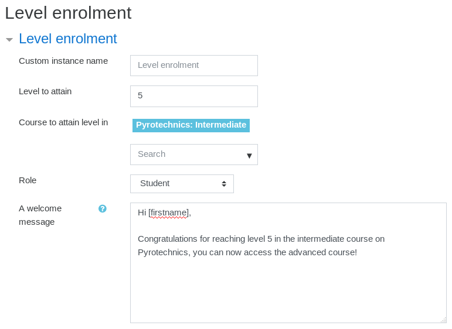

# Level-based course enrolment

:::info

This feature requires the enrolment plugin [Level Up XP Enrolment](https://moodle.org/plugins/enrol_xp) to be installed and enabled.

:::

1. Go to the course to unlock at a certain level
2. Navigate to the enrolment methods page
   - Under _Course administration > Enrolment methods_
   - Or _Participants > Enrolments methods_
3. Select _Level enrolment_ from the _Add method_ dropdown
4. Set the required level to gain access
5. When using one block per course, also select the course in which the level needs to be attained
6. Optionally add a welcome message
7. Save your changes, you're done!

More on enrolment methods at [Moodle documentation](https://docs.moodle.org/en/Enrolment_plugins).
