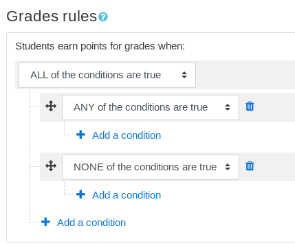
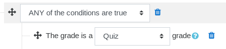
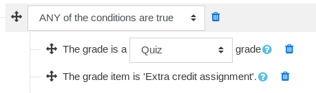
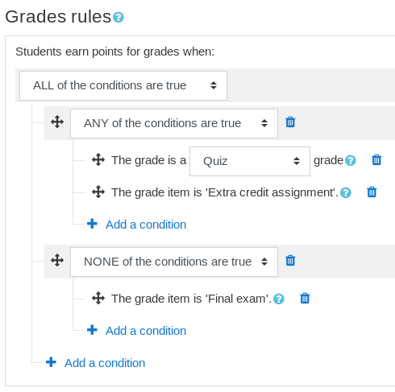

# Grade-based rewards

import RequiresXpPlus from '@site/src/components/RequiresXpPlus';

<RequiresXpPlus />

Grade-based rewards allow educators to award points to students according to the grade they received.

## How does this work?

The plugin will observe events associated with grades being updated, when those occur, they will be compared to the conditions that have been defined by educators. When the conditions are met, the student will be awarded points equal to the grade, whereby a grade of 5 out of 10, and a grade of 5 out of 100 both award 5 points.

When a grade changes after a reward for this grade was already awarded, the next reward will be adjusted. When the next grade is lower, nothing happens as we never take points away from students. When the next grade is higher, we award points equal to the difference. This means that students always get a total reward equal to their best recorded grade.

Example: Alice submits an assignment, and receives the mark of 40/100. In _Level Up XP_, Alice receives 40 points for her grade. Alice then reattempts her assignment, but this time her grade is lowered to 25/100. Alice's points in _Level Up XP_ do not change. For her final attempt, Alice scores 60/100, she earns 20 additional points, her total of points earned is 60.

## Gamification considerations

Performance-based rewards can introduce a negative effect, especially for students experiencing difficulties, as students may feel that they are being penalised instead of being rewarded. When misused, they can compromise the effectiveness of gamification and only act as a boost for already well-performing students. We advise that you scarcely use grade rewards, and use them in a context where all students can achieve the maximum score such as quizzes with unlimited attempts, or greatly limit the amount of points that they contribute to.

## Creating grade rules

In this example, we will be creating a rule that rewards students for taking a single assignment, and for taking any quiz (except for one). Our course is set-up like this:

- 5x quizzes, used for self-assessment, with unlimited attempts with maximum grade of 100.
- 1x quiz, used as final exam, with a single attempt and a maximum grade of 100.
- 1x assignment, used as extra credit, with a maximum grade of 10.
- The course total is 100, as it excludes the grades from our 5 self-assessment quizzes.

We want our students to be rewarded for taking the self-assessment quizzes, and the extra credit assignment. We do not want them to earn points for any other grades they may receive, including the _final exam_ one.

Navigate to the block's **rules page**.

Start by adding two **Set of conditions**, the first one is set to _ANY of the conditions are true_, and the second one is set to _NONE of the conditions are true_. Then update the **top condition** to _ALL of the conditions are true_, this tells the plugin that both sets of conditions must be true for the grade rewards to apply.

In the "ANY" condition group, add a new **Grade type** condition and set it to **Quiz**. This means that any grades received in quizzes will apply. At this point, this would still award points for taking our _Final Exam_ quiz, we will sort it out later.

Still in the "ANY" condition group, add a new **Specific grade item** condition, and select the **Extra credit** assignment activity.

Together, these two conditions say that when a grade is received in any quiz, or in the assignment activity called _Extra credit assignment_, a grade reward will be awarded.

The final step is now to exclude the _Final exam_ quiz from the rewards, to do this add a **Specific grade item** condition in the "NONE" condition set. The entire rule block should now look like this:

That's it, our students will now be rewarded for taking our self-assessment quizzes, and the extra credit activity, but they won't receive points for taking the final exam.

:::tip

The above tutorial can be restored in a Moodle course using this [backup file](backup-grades-demo.mbz).

:::

## Important notes

- Negative grades are not supported as points cannot be taken away from students.
- Grade rewards are not retroactive, points are awarded when students are being graded.
- Points will be awarded even when the grade is currently hidden to the student. You should be wary of this when creating grade rules if you are concerned that students could infer their grades from the points they receive.
- Only the grades published to the gradebook are supported.
- The cheat guard never blocks grade rewards.
- The plugin's _Log_ page displays the points awarded, and the grade item from which the reward originated.
- Since _Level Up XP+ 1.11_, the grades are rounded to their nearest integer, whereby a grade of 20.51 will award 21 points, and a grade of 20.49 will award 20 points. Prior to this version, the grades were always rounded down which sometimes lead to points being 1 point less than the grade due to floating point inaccuracies.
