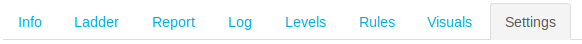
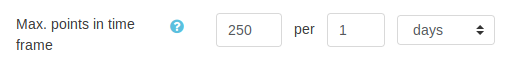

# Limits points per day

import RequiresXpPlus from '@site/src/components/RequiresXpPlus';

<RequiresXpPlus />

To keep things under control, you may want to cap the amount of points your students can earn per day, or other time window. This can be useful to attempt to reduce the gaps between active and passive students.

For the sake of demonstration, let’s decide to cap our students’ maximum earnings to `250` points per day. Navigate to the block’s **settings page**.

Scroll to the section **Cheat guard**. The setting we are interested in is **Max. points in time frame**. The first field contains the maximum number of points allowed, and the two following fields control the time window.

The above example shows how to limit to `250` per day.

### Good to know

- This setting could have a negative impact on your students’ overall experience, as they may not understand why they stopped earning points, and be discouraged.
- A day is intepreted as _in the last 24 hours_, it is not reset at midnight. The same goes for other time windows.
- If the points to be given will exceed our limit, none are given. For example, if a student has already earned 240 out of 250 points in the last 24 hours, and performs an action weighted at 15 points, they will not be given any points.
