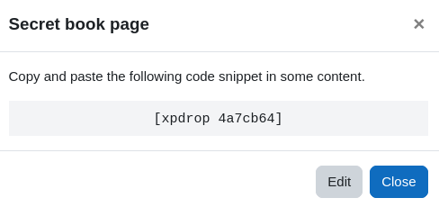

# Use drops

import RequiresXpPlus from '@site/src/components/RequiresXpPlus';

<RequiresXpPlus />

Drops are code snippets that an instructor can _hide_ in the content of a course to award points when said content is being presented to the learner.

The drops can be placed in many locations, such as the description of an activity, the feedback at the end of a quiz, the page of a lesson, and more.

By placing drops in these locations, an instructor can create new ways to award points, reward deep learning and even provide points for failing a question!

Drops are invisible to the learner and only award their associated points once.

:::info

**Why is it called drop?** In video games, some characters can _drop_ items or experience points on the ground for the player to pick up. These items and points are commonly referred to as drops.

:::

## Creating drops

Navigate to the page found in the plugin's _Settings > Points > Drops_, and click on the button to add a drop. You will be asked to provide the name and points of the drop.

The **name** is only visible to you and is useful to organise your drops. The name will be displayed to _you_ when you preview the content where the snippet was place.

The **points** is the amount of points to award a learner when they load the page where the drop has been placed. Points are only awarded the first time the drop has been found.

There also is an option to disable the drop, in which case it will not award points until it is enabled again.

Once the information has been provided, continue by saving the page.

## Placing the drop

Once a drop has been created, you need to copy its snippet and place it in some content.

To get the code snippet of the drop, click on its name from the _Settings > Points > Drops_ page. This will open a popup showing a snippet looking something like `[xpdrop abc123]`. Copy the snippet to your clipboard.

Now, place this code into some content in Moodle, via an HTML editor, and save. To test your first drop, we recommend that you place it directly on the course page. To do so, navigate to the course page, turn editing on, and edit a section/topic (see menu on the same level as the section name). Place the drop in the section's description and save.

As you navigate back to the course page, the drop will display to you as "Drop: Name of drop". At this moment, any learner visiting the course will earn the points associated to the drop, once.

That's it!

:::caution

Note that the code snippet **must not** be shared with learners.

:::

:::tip

Did you know that you can wrap the snippet within the shortcode `[xpiflevel]` to conditionally award the drop points? The example code below will only trigger the drop if the learner's level is below 5. [Read more](../use-shortcodes/index.mdx#xpiflevel)

    [xpiflevel <5][xpdrop abc123][/xpiflevel]

:::

## Troubleshooting

If the drop does not appear to be working, please check each items in the following order:

- Is the drop "enabled" in its settings?
- Is the code snippet correct?
- Is the drop displayed as "Drop: Name of drop" to the instructor?
  - If not, the plugin [Shortcodes](https://moodle.org/plugins/filter_shortcodes) may be missing.
  - Or, the plugin Shortcodes is not enabled in the given context, see filters.
  - Or, the content is not compatible with filters.
- Has the test user previously earned this drop? In doubt create a new drop, or use a new user account.
- Has the user earned the points? Check their XP logs.
  - If not, this is likely a permission issue. The user needs the permission _block/xp:earnxp_ to earn points from drops.
