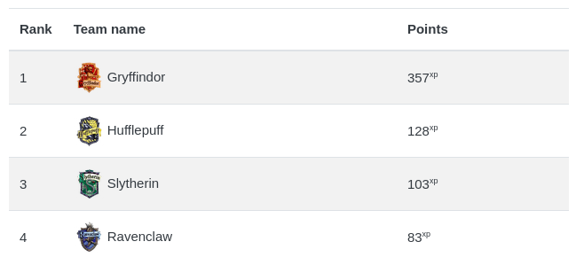

# Set-up the team leaderboard

import RequiresXpPlus from '@site/src/components/RequiresXpPlus';

<RequiresXpPlus />

The team ladder, or team leaderboard, is a ranking of teams based on their members' points.

## Constructing the teams

The setting _Team up students using_ determines how learners are grouped together.

### Course groups

When set to _Course groups_, the groups of the course (or the front page) will be the teams. Learners can belong to more than one team if they are members of more than one group. Only groups with at least one member with points will be displayed in the leaderboard.

To limit the groups displayed in the leaderboard:

1. Create a new [Grouping](https://docs.moodle.org/en/Groupings)
2. Add all relevant groups to the above grouping
3. Navigate to the [course settings](https://docs.moodle.org/39/en/Course_settings#Default_grouping)
4. Set the course's [default grouping](https://docs.moodle.org/en/Groupings#Setting_the_default_grouping) to the grouping from step #1

:::tip

Add pictures to the groups to make the leaderboard more personalised. Pictures can be added from the Moodle interface where the groups are managed.

:::

### Cohorts

When set to _Cohorts_, the teams will be based on the system cohorts. You can mark cohorts as hidden to prevent them from being displayed on the leaderboard.

## The ranking strategy

:::note

Prior to XP+ 1.10.0, this was called "Order by".

:::

This option determines how the teams are ranked against one another.

### Points

When set to _Points_, the teams are ranked based on the sum of the points of their members. This works well when teams have similar sizes, or when team members can _do more_ to earn more points and thus compensate for their lack of members.

### Points (with compensation)

When set to _Points (with compensation)_, the points of teams with less members than others are compensated using their team's average per member. For example, if a team lacks 3 members, their total points will be increased by three times their average per member. This creates a balanced ranking where all teams have equal chances.

The following document illustrates the computations: [Team ladder compensation example](https://docs.google.com/spreadsheets/d/1SOZbBx5ImheUhOdoOCCnZ2m3FbAuV4uz0hSyXJQb6Hw/edit)

:::note

This feature was introduced in XP+ 1.10.0

:::

### Progress

When set to _Progress_, the teams are ranked based on their overall progression towards all of its members reaching the ultimate level, without compensating their points. You may want to use _Progress_ when the teams are unbalanced, for example when some teams have more members than others.
