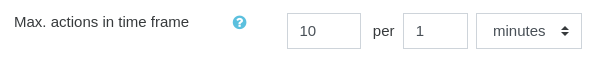
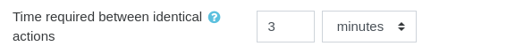
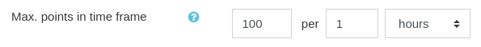

# The cheat guard

As the [event rules](../introduction.mdx) award points based on learners' actions, some learners may be tempted to abuse the system by repeating similar actions, or by performing quick actions again and again. To remedy this, XP comes with a built-in protection called the "Cheat guard".

It is important that you understand how the cheat guard works to prevent abuses while rewarding legitimate actions.

:::info

The cheat guard only applies to the points received from the [event rules](../introduction.mdx).

:::

## What does the cheat guard do?

The cheat guard simply checks whether the student is _allowed_ to earn points for a certain action. When they are not, the action is ignored completely. Some actions only ever occur once, so if the cheat guard ignores the action, the student's unique chance to earn a reward for that action is gone forever.

## Differences between versions

Aside from having additional settings, XP+ has a more reliable cheat guard system built-in that covers long time frames (weeks to months instead of hours). It is also important to note that the cheat guard of the _free_ version does not protect from abuse using the mobile apps.

## The options

### Max. actions in time frame

This determines how many actions a learner is allowed to perform within a given time frame. Once they reach the maximum allowed, all further actions will be ignored until they no longer exceed the limit.

In the example above, 10 actions are allowed per 1 minute, so on average we could say that 1 action every 6 seconds is acceptable. Moodle sometimes triggers more than one action at the same time, so instead of risking to be too strict we aim at discouraging cheaters.

### Time required between identical actions

This is probably the most important cheat guard setting. It prevents students from the doing the same thing over and over again to earn points endlessly. But, what is an _identical action_? An action is determined to be identical when it happens in the same place and is related to the same resource or person. For instance, responding to the same forum discussion twice is considered identical, but submitting two assignments in two different assignment modules is not.

In the example above, a student cannot do the same thing twice within 3 minutes.

Note: it happens that Moodle's event definition tricks XP into thinking that two actions are not identical. If you notice that some events are not being caught by the cheat guard, you may want to add a specific rules to ignore them.

### Max. points in time frame

import RequiresXpPlus from '@site/src/components/RequiresXpPlus';

<RequiresXpPlus />

The maximum number of points students are allowed to earn within a given time frame. This may be more useful as a fail safe in case some students earn drastically more than others. You could also use this option to encourage students to come back to their learning, although do not forget to let them know that their points are capped after a certain amount.

In the example above, students cannot earn more than 100 points per hour. If our student has currently earned 90 points in the last hour, and an action is about to reward them 15 points, they will not earn anything. Students will not get points if those would cause the total to exceed the limit.

## Cheat guard bypass

Some methods always bypass the cheat guard because they cannot be abused by students:

- Points from activity, section and course completion
- Points imported, and manually given by educators
- Points based on grades

Note that the above methods will still count towards the action or point limits for other actions.
