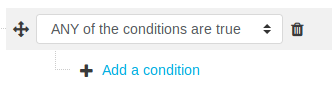
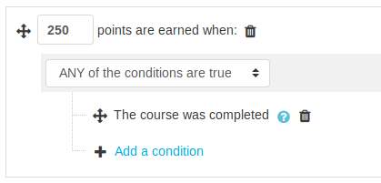

# Reward course completion

import RequiresXpPlus from '@site/src/components/RequiresXpPlus';

<RequiresXpPlus />

:::warning[Outdated]

This method is now outdated, with the [completion rules](../../completion-rules/index.mdx) feature in XP+ 1.16 serving as a more straightforward alternative. Please refrain from using the older method and switch to the newer one for ease of use.

:::

Course completion with _Level Up XP_ allows you to reward your students for completing a course. This is particularly useful when the plugin is used sitewide, where points are gathered for actions taken in any course. In order for _Course completion rewards_ to work, _Completion_ must be enabled in Moodle.

Navigate to the block's **rules page**.

import XpRulesPageLocation from '@site/src/components/XpRulesPageLocation';

<XpRulesPageLocation />

We will create a new rule telling the plugin that whenever a student completes a course, they should receive `250` points. Click on the first **+ Add a rule** option. This will add an empty condition set on top of all the other ones, like this:

After changing the points to be earned to `250`, click on **+ Add a condition** and select **Course completion**. And that’s it, now your students will be rewarded for completing their courses.

### Important note

Points are not awarded instantly, they require [Moodle cron](https://docs.moodle.org/en/Cron) to run. Please keep this in mind when testing this feature.
