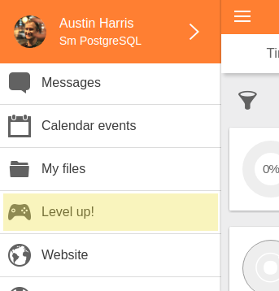
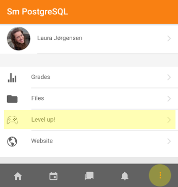
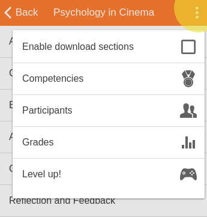

# Not showing in Moodle Mobile app

Before anything else, note that _Level Up XP+_ is required to use _Level Up XP_ with the Moodle Mobile app. A recent version of the Moodle Mobile app and Moodle 3.1 are also required.

### Access from within the app

If you have installed _Level Up XP+_, no further steps are required for it to be accessible using the official Moodle Mobile app. It also works with custom versions of the Moodle app, provided they are recent.

Accessing _Level Up XP_ from the app will be different depending on how it is set-up on the Moodle site. If it was set to be used __For the whole site__, it will be appear in the main menu:

When set to be used __In courses__, _Level Up XP_ is accessible from different locations.

From the course menu within a course.

From the dropdown menu on the course's main page.

From the dropdown menu on the _Course overview_ screen.

### Interoperability with newer Moodle apps

Moodle provides an additional plugin called _[local_mobile](https://moodle.org/plugins/local_mobile)_ which enables newer versions of the mobile apps to work with older versions of Moodle.

For example, in June 2018, the new Moodle app was released (codename Moodle Mobile 3.5), and was designed to work seamlessly with Moodle 3.5. However, previous Moodle versions (3.1 to 3.4) require the _local_mobile_ plugin to be installed for all features to be supported. If the latter is not installed, _Level Up XP_ will not appear.

- Download [local_mobile here](https://moodle.org/plugins/local_mobile)
- Follow the installation instructions at [Moodle documentation](https://docs.moodle.org/en/Moodle_Mobile_additional_features#Installation)

__Protip:__ After installing _local_mobile_, you may need to remove your site from the Mobile app and add it again.

### Checklist

- Moodle 3.1 or later is being used.
- A recent Moodle Mobile version is being used.
- The plugin [local_mobile](https://moodle.org/plugins/local_mobile) __must__ be installed and enabled for interoperability between older Moodle versions and the newer versions of the Moodle apps. After installing _local_mobile_, you may need to remove the site from the Mobile app and add it again.
- From Moodle 3.3, _Level Up XP_ __must not__ be disabled in _Site administration > Mobile App > Mobile features_. The settings's name is `tool_mobile | disabledfeatures`.
- The _Level Up XP_ block __must__ have been added to the Moodle site, either to the front page or the _default_ dashboard, or to the relevant courses.
- When using Moodle Classic (formerly known as Moodle Mobile), allow a few minutes for the _remote add-on_ to be loaded in the app the first time.
- Changing site and logging back in (_Main menu > Change site_) may help the app become aware of the existence of _Level Up XP_.
- Waiting 5 minutes may help as it allows for local caches to expire.